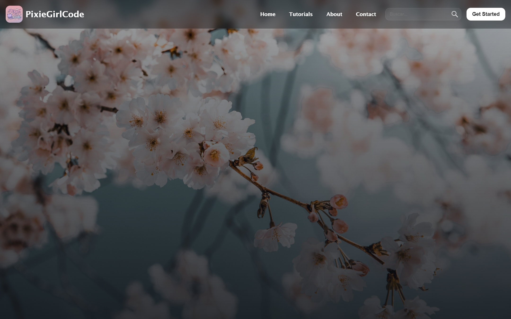
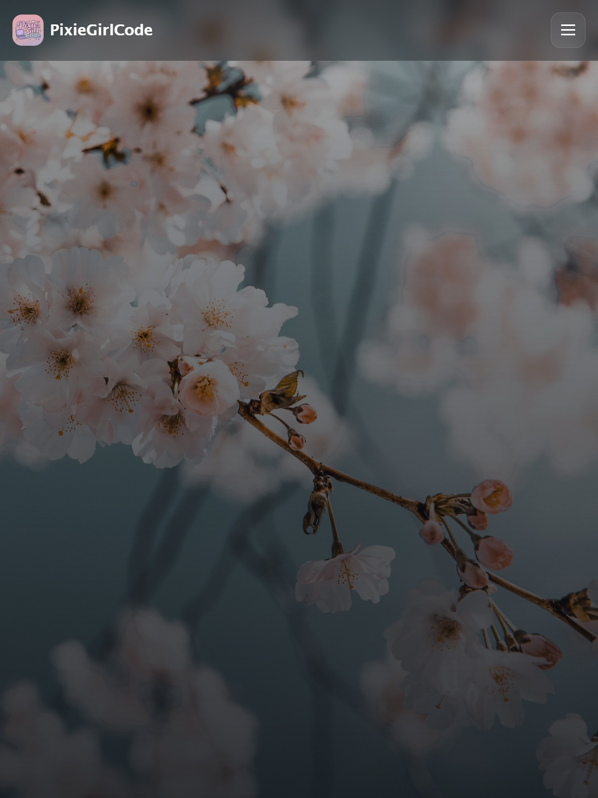
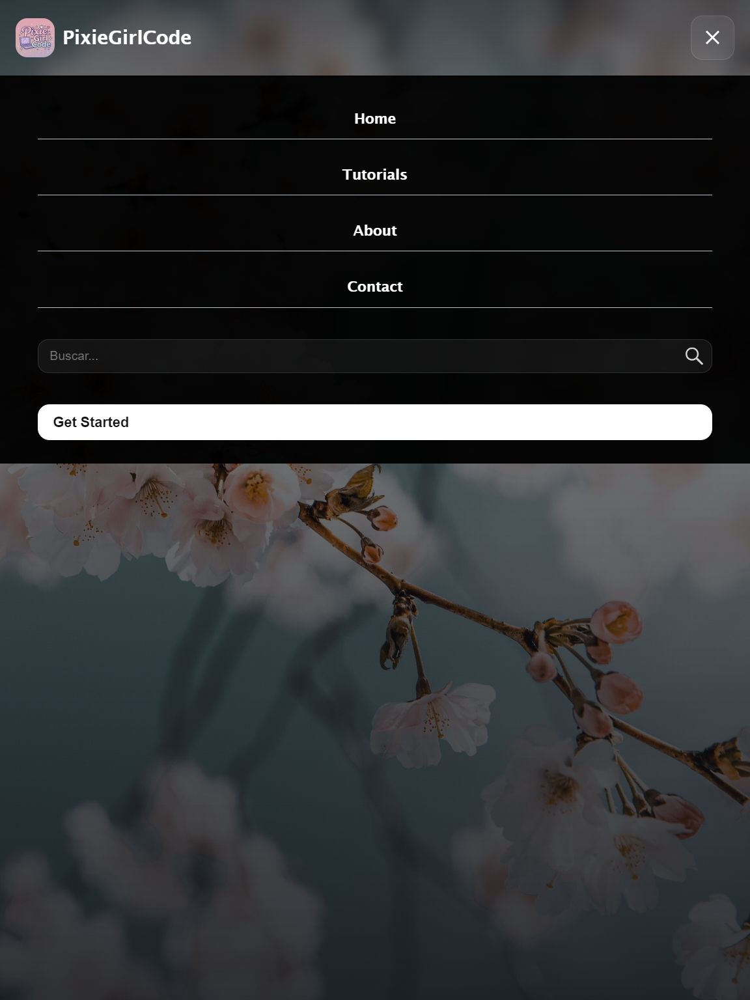

# 🌸Responsive Navbar  🌸

Aquí creé un **navbar responsive**  con logo, menú, botón y buscador.  
Perfecto para mis mini proyectos web y para practicar **HTML y CSS** 🪐  

---

## ✨ Features ✨
- Navbar sticky con **blur y gradientes**  
- Logo + nombre de marca  
- Menú responsive que se transforma en hamburguesa en pantallas pequeñas  
- Formulario de búsqueda 
- Botón “Get Started” con hover efecto 

---

## 💖 Tech Stack
- HTML   
- CSS 
    
---

## 📸 Capturas

  
  

